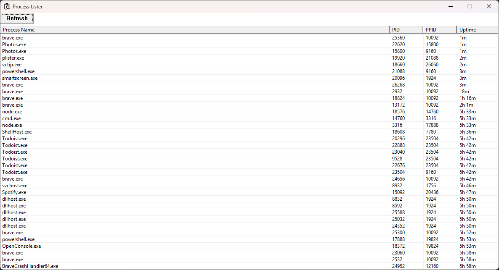

# Windows Process Lister

Lightweight Windows process viewer written in C using the Win32 API. Lists all running processes with their name, PID, PPID, and uptime.



## Requirements

- Windows 10/11 x64
- Visual Studio 2022 C++ dev kit (only to build from source)

## Usage
 
```powershell
.\plister.exe
```
 
- Sort by any column — click the header 
- Kill a process — right-click and confirm
- Reload the list — click the Refresh button

> Some processes won't show uptime and cannot be killed, unless you run as **Administrator**. 

## Build

> If you don't trust the binary, build from source.

```powershell
.\build.ps1
```

Requires `cl.exe` (MSVC) on your PATH. Use `developer PowerShell for VS` for better results.

## License

MIT License — see [LICENSE](LICENSE) for details.
